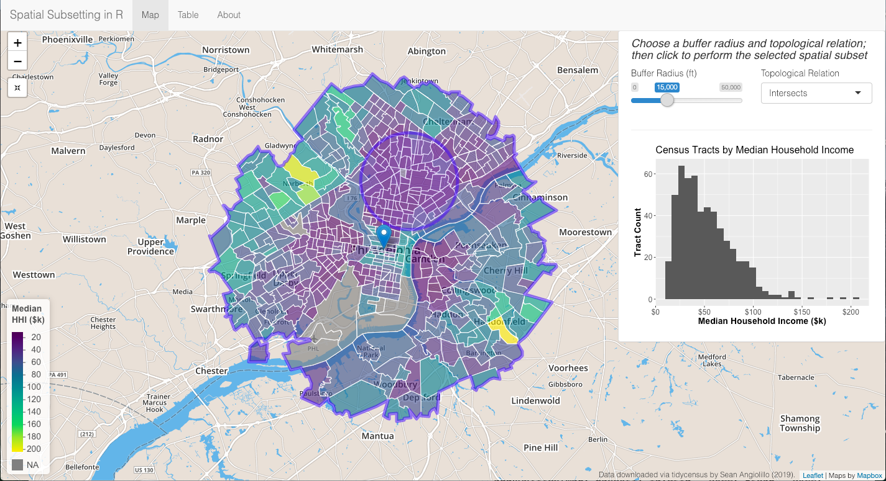

```{r setup, include=FALSE}
knitr::opts_chunk$set(echo = TRUE)
```


Thus far in this GIS series, we have introduced the following:

* use cases for geospatial data

* getting started with the `sf` package

* manipulating attributes of geospatial data in a tidy workflow

* visualizing geospatial data through a wide array of static, interactive and animated maps

However, we have yet to really do anything useful with the actual geometry of our geospatial data. In this post, we will introduce **spatial subsetting**, an important family of operations applicable to geospatial data.

## What is Spatial Subsetting?

We have seen how to manipulate `sf` spatial dataframes through their attributes, as we would do with normal dataframes. For instance, with `dplyr`, we can filter a spatial dataframe to keep only observations matching certain factor levels or having a numeric variable above or below a certain threshold. In a similar fashion, we can also filter observations using the geometry column of our geospatial data.

As defined in Geocomputation with R, *"Spatial subsetting is the process of selecting features of a spatial object based on whether or not they in some way relate in space to another object."*

* Read More: Chapter 4 Spatial data operations of [Geocomputation with R](https://geocompr.robinlovelace.net/spatial-operations.html) is the place to start learning about spatial subsetting in R.

To take an example using our previous dataset of Indian states, we might wish to filter for only states that share a border with Delhi NCR. In other cases, rather than filtering by attributes like states or districts, we may only care about states or districts within a certain distance from a particular point of interest. Spatial subsetting operations allow us to perform these kinds of manipulations.

### Topological Relations

Many different types of spatial subsetting operations are available to us at our fingertips. Different types of spatial relations are more formally called topological relations. The two examples given above describe different topological relations. The former is looking for a common border, or perhaps areas that "touch", whereas the latter is looking for areas "within" another area.

As implemented in the `sf` package, you will find these operations in functions like `st_intersects()`, `st_disjoint()`, `st_within()`, `st_contains()`, `st_touches()`, `st_crosses()` and several others. The documentation for any of these functions brings up the complete list.

These functions require a pair of `sf` geometry sets, namely a target object and a selecting object. Before diving into the specific syntax, let's first get a sense of how these relations are defined.

The simplest is `st_intersects()` and its inverse `st_disjoint()`. Supplying two `sf` objects to `st_intersects()` will return all observations that intersect with each other in any way. Conversely, `st_disjoint()` returns observations that have absolutely no intersection.

Another pair of operators is `st_within()` and `st_contains()`. Rather than returning any intersection, both of these operations return only observations that lie entirely within one object or another. The designation of "x" and "y" arguments determines whether `st_within()` or `st_contains()` is actually the operation you need. `st_within()` returns observations in "x" that fall entirely within "y". `st_contains()` returns observations in "x" that entirely contain "y".

* Read More: These relationships are much easier to understand with diagrams. [GITTA](http://www.gitta.info/SpatialQueries/en/html/TopoBasedOps_learningObject1.html) has a useful introduction to topological relations, complete with Venn diagrams of each. More diagrams can also be found on [Wikipedia](https://en.wikipedia.org/wiki/DE-9IM). One more possible resource of interest is [S Ogletree's investigation](https://rpubs.com/sogletr/sf-ops) which uses toy data within R to observe the differences in relations.

### Preparing Data

Before diving in to the syntax of spatial subsetting, we need some sample data. As an example, I will use the `tidycensus` and `tigris` packages to download median household income data for the Philadelphia metro area at the census tract level.

* Note: In the US Census hierarchy, census tracts are below counties and above block groups. See Kyle Walker's `tigris` [slides](https://walkerke.github.io/tigris-webinar/#6) for more information. 
* Read More: There are a number of good introductions to get started using Kyle Walker's `tidycensus` and `tigris` packages. The [documentation](https://walkerke.github.io/tidycensus/articles/spatial-data.html) is one of them. Note that you will need to get an API key from the Census Bureau.

```{r include=FALSE}
library(tigris)
library(sf)
library(tidycensus)
library(tidyverse)
library(rvest)
options(tigris_class = "sf")
options(tigris_use_cache = TRUE)

api_key <- "3bcdcf966c06f679fe1abb540eac2f5c33694350"
census_api_key(api_key)
```

```{r eval=FALSE}
library(tigris)
library(sf)
library(tidycensus)
library(tidyverse)
library(rvest)
options(tigris_class = "sf")
options(tigris_use_cache = TRUE)

api_key <- "YOUR_API_KEY"
census_api_key(api_key)
```

The `tigris` package does have a `core_based_statistical_areas()` function for downloading shapefiles of metro areas, but instead we will start with a table of counties covering our area of interest and then demonstrate how to obtain a more narrow geographic area through spatial subsetting.

```{r include=FALSE, eval=FALSE}
# create df of states and counties
counties <- tribble(
    ~state, ~county,
    "PA", "Philadelphia",
    "PA", "Montgomery", 
    "PA", "Bucks",
    "PA", "Delaware",
    "NJ", "Burlington",
    "NJ", "Camden",
    "NJ", "Gloucester"
)

# query tidycensus and combine data into one sf object
raw_tracts <- map2(counties$state, counties$county, function(x, y) {
    get_acs(geography = "tract", state = x, county = y,
            variables = c(hhincome = "B19013_001"), 
            geometry = TRUE)
}) %>% 
    do.call(rbind, .)

saveRDS(raw_tracts, "raw_tracts.rds")
```

```{r eval=FALSE}
# create df of states and counties
counties <- tribble(
    ~state, ~county,
    "PA", "Philadelphia",
    "PA", "Montgomery", 
    "PA", "Bucks",
    "PA", "Delaware",
    "NJ", "Burlington",
    "NJ", "Camden",
    "NJ", "Gloucester"
)

# query tidycensus and combine data into one sf object
raw_tracts <- map2(counties$state, counties$county, function(x, y) {
    get_acs(geography = "tract", state = x, county = y,
            variables = c(hhincome = "B19013_001"), 
            geometry = TRUE)
}) %>% 
    do.call(rbind, .)

glimpse(raw_tracts)
```

```{r echo=FALSE}
raw_tracts <- readRDS("raw_tracts.rds")
glimpse(raw_tracts)
```

We now have 1,186 census tracts covering the Philadelphia metropolitan area. This is a larger area than we want to cover so we will spatially subset this dataset to a smaller area based on distance from a central point of interest, in this case Philadelphia's City Hall. Before we can do this however, it is important to be mindful of the coordinate reference system (CRS) of our geospatial data. The commands below inform us that our data has a geographic CRS with EPSG code 4269.

```{r}
st_crs(raw_tracts)
st_is_longlat(raw_tracts)
```

In order to use spatial subsetting operations, we need to reproject our data from a geographic CRS to a projected CRS. In this case, we've chosen to use EPSG code 2272.

* Read More: For more information on coordinate reference systems, see Chapters 2 and 6 of [Geocomputation with R](https://geocompr.robinlovelace.net/reproj-geo-data.html).

```{r}
proj_crs <- 2272
proj_tracts <- raw_tracts %>% 
    st_transform(crs = proj_crs)
st_crs(proj_tracts)
```

Now that we have projected census tracts, we will define a circle and use it as the second geometry feature set by which we will subset the census tracts.

```{r}
# choose a central lng lat point and radius to define circle
city_hall_lng <- -75.1657936
city_hall_lat <- 39.952383
geo_crs <- 4326
buffer <- 55000 # ft (same units as crs)

circle <- st_sfc(st_point(c(city_hall_lng, city_hall_lat)), 
                 crs = geo_crs) %>% 
    st_transform(crs = proj_crs) %>% 
    st_buffer(dist = buffer)

st_crs(circle)
```

As shown in the map below, with these two simple feature geometry sets in the same projected CRS, we are ready to spatially subset.

```{r echo=FALSE}
ggplot() +
    geom_sf(data = raw_tracts) +
    geom_sf(data = circle, color = "red", fill = NA) +
    labs(title = "Census Tracts in the Philadelphia Metro Area")
```

### Spatial Subsetting Syntax

In R, there are often multiple ways to achieve the same result. More specifically when it comes to subsetting, we have a base R method using the square bracket `[` and a tidyverse method using `filter()`. Spatial subsetting is no exception. Within the `sf` package, both options are available to us.

Using the square bracket method, the syntax is remarkably simple. It is very similar to bracket subsetting of a dataframe, but inside the square bracket, where a logical expression would filter rows, you just need to place the selecting simple feature geometry, i.e. a spatial dataframe, `sfc_POLYGON`, etc. 

In the example below, we subset the original 1,186 census tracts by those having an intersection with the circle we have defined. The result is a new `sf` spatial dataframe with 617 observations.

```{r}
philly <- proj_tracts[circle,]
glimpse(philly)
```

By default, `st_intersects()` is the unspoken topological operator when using the square bracket for spatial subsetting. Setting the "op" argument allows us to choose any topological relation instead of the default `st_intersects`. In the example, below, we've chosen `st_disjoint()`. Note that the 617 observations returned from the intersection, when added to the 569 observations return from `st_disjoint()`, sum to the original 1,186 tracts.

```{r}
philly_dj <- proj_tracts[circle, , op = st_disjoint]
nrow(philly_dj)
```

A second method of spatial subsetting involves creating an intermediary object of the class "sparse geometry binary predicate" (sgbp), which is essentially a list of matching indices we can use to subset the target object. Under this method, rather than setting an "op" argument, we use a different topological operator beginning with `st_*`. 

Moreover, we have the option of a returning a sparse or a dense matrix, which slightly affects the syntax as shown below. This method fits more easily into a tidy workflow as evidenced by the use of `dplyr`.

```{r}
# sgbp, sparse matrix
philly_sparse <- proj_tracts %>% 
    filter(lengths(st_intersects(x = ., y = circle)) > 0)

# sgbp, dense matrix
philly_dense <- proj_tracts %>%
    filter(st_intersects(x = ., y = circle, sparse = FALSE))
```

Regardless of which method you choose, all three methods should return the same number of observations in a spatial dataframe of the same CRS. To give one example of this tidy workflow, note below how we can start with our original spatial dataframe, perform a spatial subset (in this case `st_within`), and directly pipe the result into `ggplot2`. As we would expect, the result is a much smaller and more circular shape, fitting just inside the boundaries of our circle.

```{r}
city_hall <- st_sfc(
    st_point(c(city_hall_lng, city_hall_lat)), 
    crs = geo_crs) %>% 
    st_transform(crs = proj_crs) 

proj_tracts %>%
    filter(st_within(x = ., y = circle, sparse = FALSE)) %>% 
    ggplot() +
    geom_sf() +
    geom_sf(data = circle, color = "red", fill = NA) +
    geom_sf(data = city_hall, color = "blue", size = 2) +
    labs(title = "Census Tracts Within 55,000 ft of City Hall")
```

### Explore Spatial Subsetting via Shiny

While seeing the syntax and observing a few diagrams can be a useful way to understand spatial subsetting, being able to repeatedly practice with different operations and quickly observe the results can make this concept more concrete. With this aim in mind, the [shiny app linked here](https://seanangio.shinyapps.io/spatial-subset/) is designed to allow users to quickly explore spatial subsetting through different topological relations.

It shows the same map of census tracts comprising the Philadelphia metropolitan area following our spatial subset above. After choosing a topological relation, users can position a circle, the size of which is their choice, over the map of census tracts and click to perform a spatial subset. 




Following a click, a few outcomes should be observed:

* The syntax of the given spatial subset, in both square bracket and dense matrix methods, appears in the right-hand panel.

* The histogram for the selection is plotted against the original distribution of census tracts.

* The choropleth color scale and legend adjusts to the selection's domain. This is especially interesting when used to reveal smaller levels of variation among a particular region. For example, when comparing income levels across the Philadelphia metro region, there is a wide disparity between wealthier suburbs and core urban areas. Spatially subsetting a more homogenous geographic area has the potential to reveal new patterns. 

### Final Thoughts

With this blog and shiny app as tools, we endeavored to help readers understand:

* the concept of spatial subsetting and when it may be useful

* differences in topological relations

* multiple ways to spatially subset your own data

Hopefully now you are well on your way to becoming as comfortable spatially subsetting your data as you would be if it were simply attribute data.
